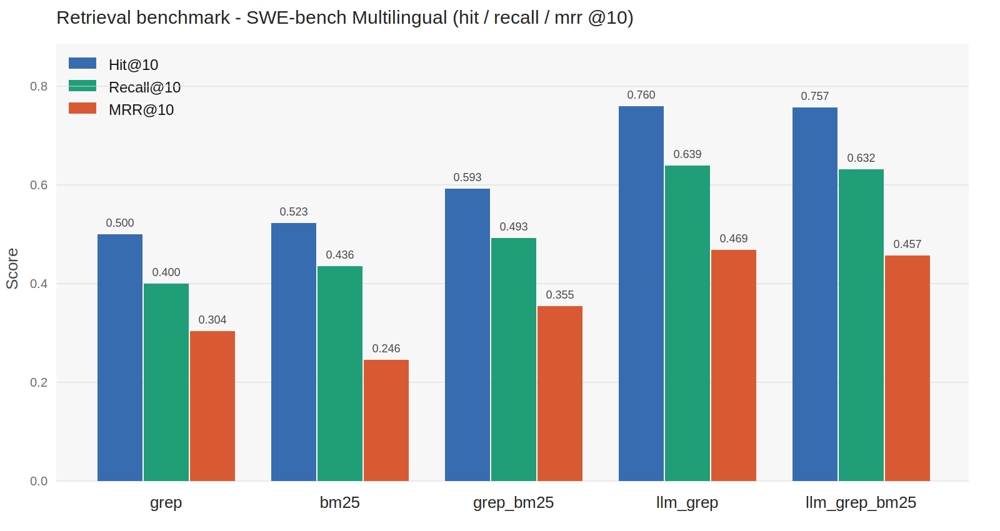

# SWE-bench Retrieval Evaluation

This repository contains a small evaluation framework for zero-shot file retrieval on SWE-bench style bug-fixing tasks.

The benchmark isolates one question: Given only a bug report, can a retrieval method rank the files that need to be changed? The framework does not require an agent loop for the retrieval benchmark. Each backend receives the issue text and returns the top `k` candidate files from the repository checkout at the base commit. The predictions are then compared against the files modified by the ground-truth patch.

## Results

The main experiment was run on SWE-bench Multilingual with 300 instances across 41 repositories. The cutoff is top 10 files. The reported table comes from run `e2e_run_20260405_162252`, executed from 2026-04-05 to 2026-04-06.

Models used for the reported run:

| Component | Model |
|---|---|
| LLM keyword extraction for `llm_grep` | MiniMax-M2.5 |
| Patch generation in the optional end-to-end run | Kimi-K2 |
| Optional embedding backend implemented in the codebase | `Salesforce/SweRankEmbed-Small` |

Only the keyword extraction model affects the retrieval numbers below. Patch generation is part of the separate end-to-end pipeline, not the retrieval-only metrics.



| Backend | Hit@10 | Recall@10 | MRR@10 |
|---|---:|---:|---:|
| `grep` | 0.500 | 0.400 | 0.304 |
| `bm25` | 0.523 | 0.436 | 0.246 |
| `grep_bm25` | 0.593 | 0.493 | 0.355 |
| `llm_grep` | 0.760 | 0.639 | 0.469 |
| `llm_grep_bm25` | 0.757 | 0.632 | 0.457 |

In this run, `llm_grep` was the strongest retrieval backend. It used an LLM only to extract precise technical search strings from the bug report, then used fixed-string grep and path-aware ranking. Adding BM25 through reciprocal rank fusion slightly reduced the multilingual metrics.

The compact multilingual result summary is available in [`results/`](results/).

## Retrieval Backends

### `grep`

Extracts heuristic keywords from the bug report, searches the repository with grep, and ranks matching files using content hits plus a path bonus. The path bonus makes filenames and directory names first-class retrieval signals.

### `bm25`

Builds a per-repository Okapi BM25 index over text files and ranks files by lexical relevance to the bug report. The BM25 corpus is cached per repository checkout to avoid repeated tokenization.

### `grep_bm25`

Runs `grep` and `bm25`, then combines their ranked lists with reciprocal rank fusion.

### `llm_grep`

Uses an OpenAI-compatible chat completion model to extract 6 to 10 precise technical identifiers from the bug report, such as function names, class names, module names, and error message substrings. It then searches with fixed-string grep (`grep -F`) and applies the same path-aware ranking as `grep`.

If the LLM call fails or no API key is configured, this backend falls back to heuristic grep.

### `llm_grep_bm25`

Runs `llm_grep` and `bm25`, then combines their ranked lists with reciprocal rank fusion.

## Metrics

All metrics are computed at `k = 10` by default.

| Metric | Meaning |
|---|---|
| `Hit@10` | Whether at least one gold file appears in the top 10. |
| `Recall@10` | Fraction of gold files recovered in the top 10. |
| `MRR@10` | Reciprocal rank of the first gold file, averaged across instances. |

## Repository Layout

```text
.
├── run_swebench_search_eval.py   # Retrieval-only benchmark
├── run_e2e_eval.py               # Retrieval plus patch generation pipeline
├── clean_patches.py              # Utility for cleaning generated patches
├── assets/                       # README figures
├── results/                      # Compact public result summaries
├── swe_repos_multilingual/       # Generated local repository checkouts
└── swe_results/                  # Generated run outputs and caches
```

The generated folders are intentionally ignored by git.

## Installation

Create an environment and install dependencies:

```bash
python3 -m venv .venv
source .venv/bin/activate
pip install -r requirements.txt
```

The no-LLM backends (`grep`, `bm25`, `grep_bm25`) can run without API credentials.

For LLM-assisted backends, configure an OpenAI-compatible endpoint:

```bash
cp .env.example .env
export LLM_API_BASE="https://api.openai.com/v1"
export LLM_API_KEY="..."
export LLM_MODEL="gpt-4o-mini"
```

The scripts read environment variables directly. They do not load `.env` automatically.

The published scripts keep model names configurable through environment variables. The reported benchmark used MiniMax-M2.5 for keyword extraction and Kimi-K2 for optional patch generation.

## Running Retrieval Evaluation

Run a small smoke test on SWE-bench Multilingual:

```bash
python3 run_swebench_search_eval.py \
  --dataset multilingual \
  --limit 3 \
  --backends grep,bm25,grep_bm25
```

Run the multilingual retrieval benchmark with the LLM-assisted backend:

```bash
python3 run_swebench_search_eval.py \
  --dataset multilingual \
  --limit 300 \
  --backends grep,bm25,grep_bm25,llm_grep,llm_grep_bm25
```

## Running End-to-End Patch Generation

`run_e2e_eval.py` extends the retrieval benchmark by reading the retrieved files and asking a patch model to produce a unified diff.

```bash
export PATCH_API_BASE="https://api.openai.com/v1"
export PATCH_API_KEY="..."
export PATCH_MODEL="gpt-4o"

python3 run_e2e_eval.py \
  --dataset multilingual \
  --limit 5 \
  --backends grep_bm25,llm_grep_bm25
```

The script writes SWE-bench-compatible prediction JSONL files. Running the official SWE-bench harness is a separate step.

## Generated Data

The first run downloads SWE-bench instances and clones repositories at their base commits. This can consume significant disk space. Generated data is written under:

```text
swe_repos_multilingual/
swe_results/
swe_embeddings/
```

These folders are ignored by git and can be deleted when no longer needed. They will be regenerated on demand.

## Notes

This benchmark is intentionally narrow. It measures the first retrieval step only: no interactive search, no file inspection loop, no retries, and no code editing. That makes it useful for comparing retrieval signals, but it is not a full coding-agent benchmark.
